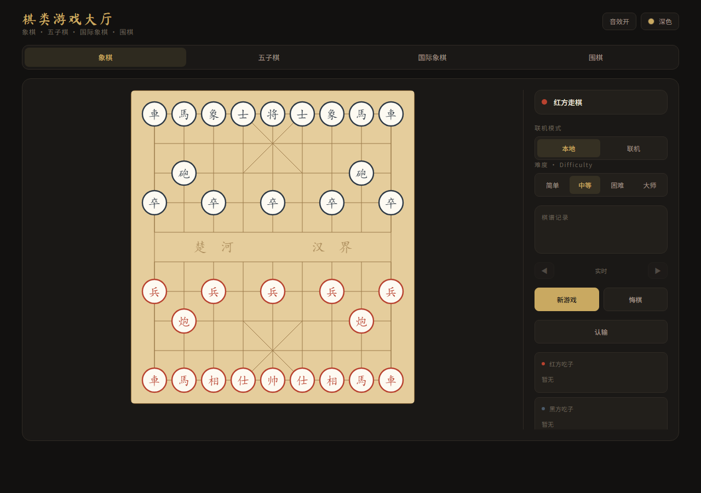
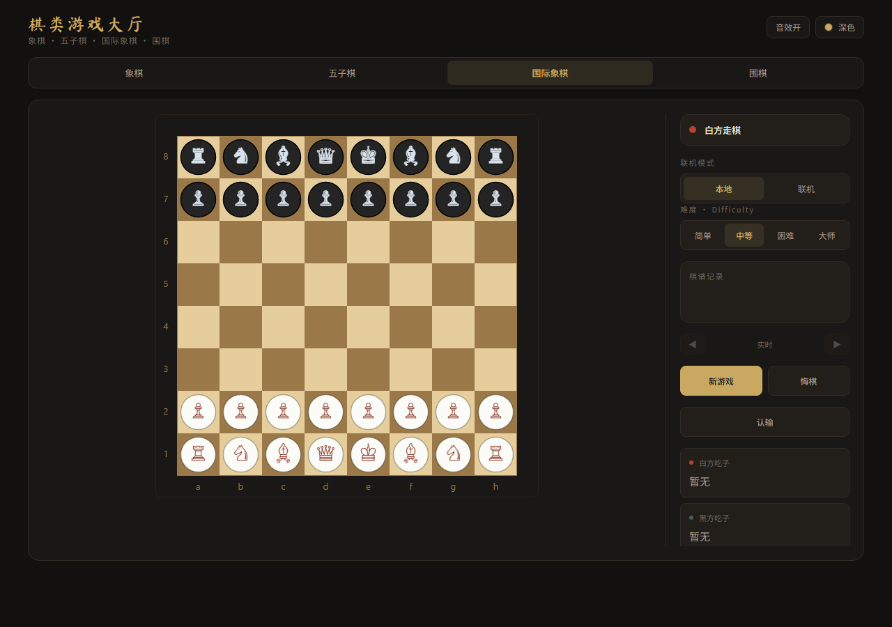
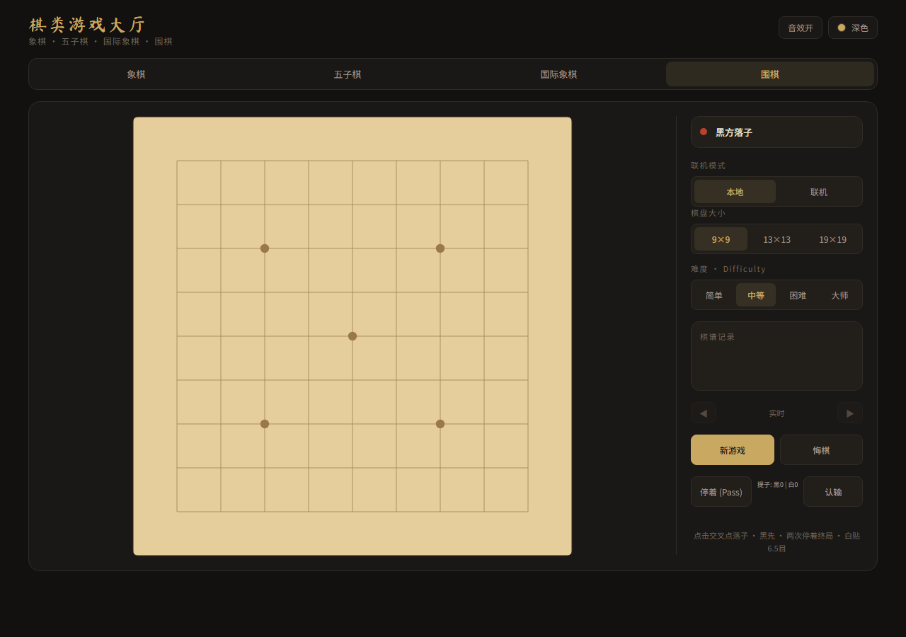
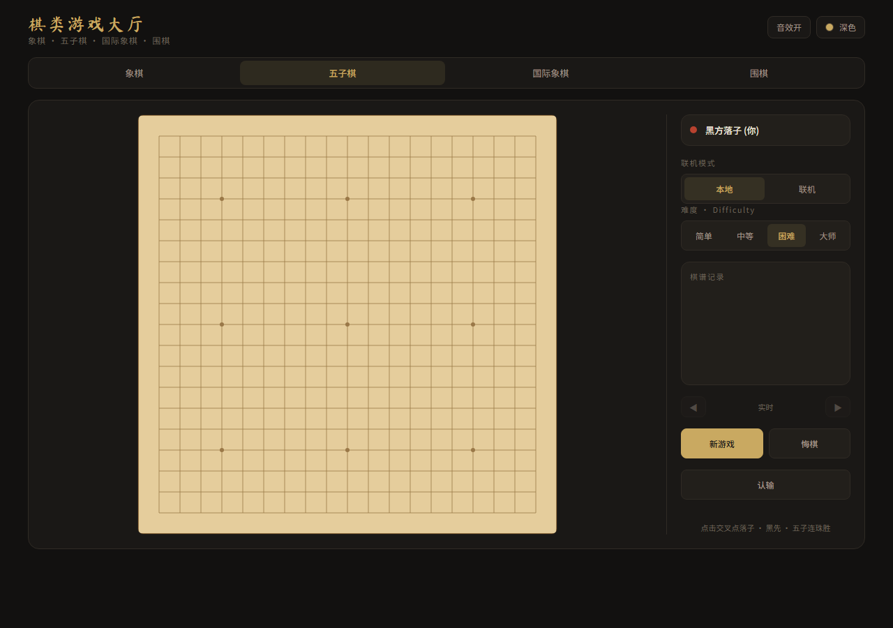
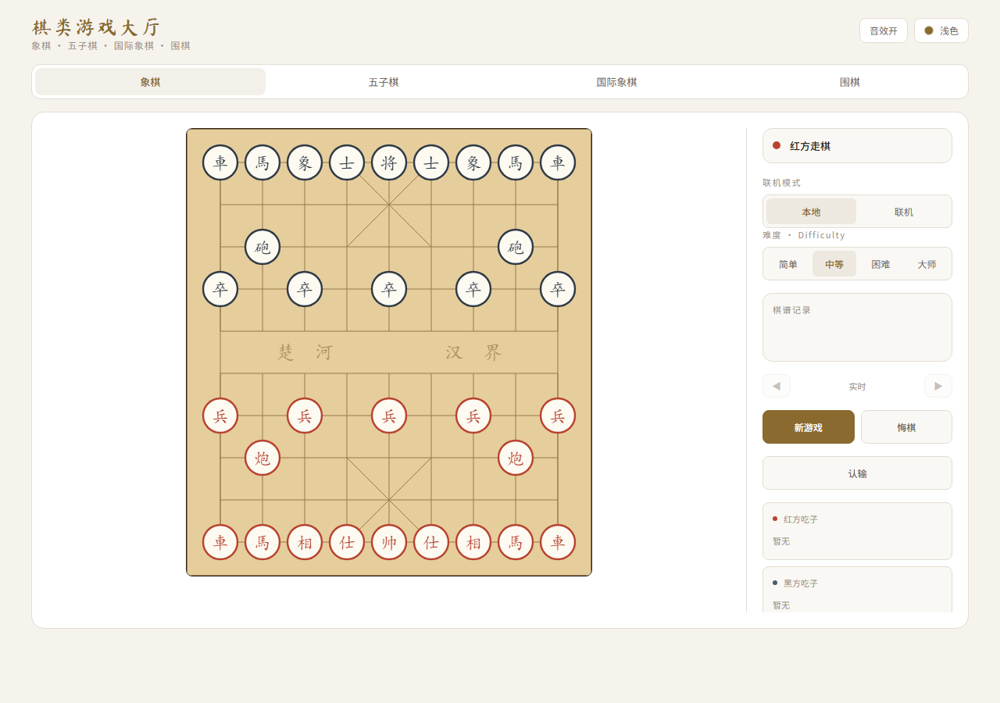
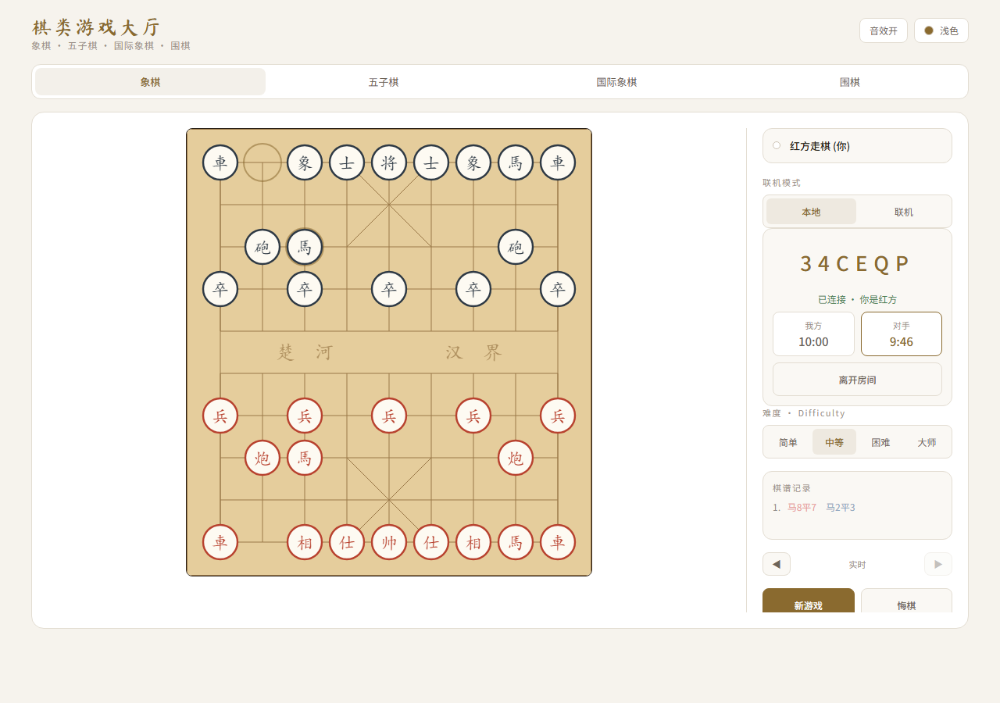
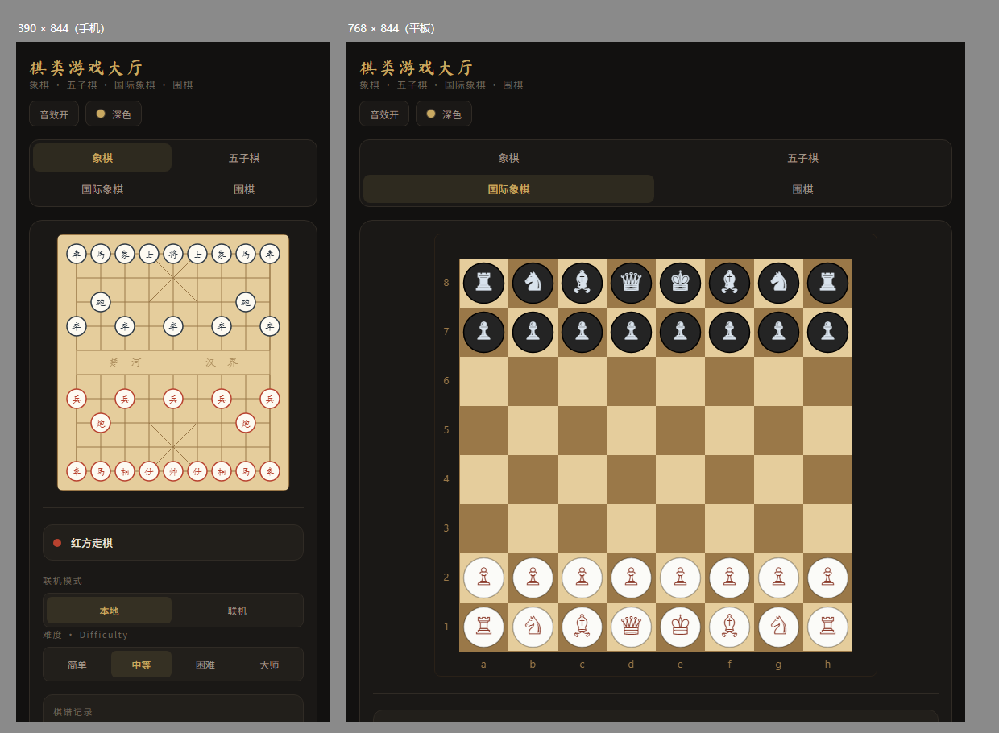
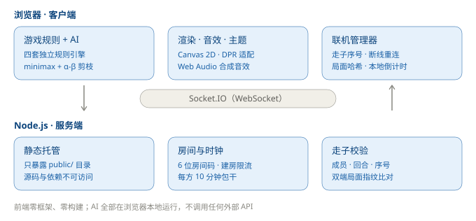

# 棋类游戏大厅

浏览器里玩的四合一棋类游戏 —— **中国象棋 · 五子棋 · 国际象棋 · 围棋**。

单机人机对战 + 联机对战。原生 JavaScript，前端零框架零构建，AI 全部在浏览器本地运行。



---

## 目录

- [亮点速览](#亮点速览)
- [界面截图](#界面截图)
- [架构](#架构)
- [工程上的优点](#工程上的优点)
- [技术上的几个巧思](#技术上的几个巧思)
- [快速开始](#快速开始)
- [项目结构](#项目结构)
- [四个游戏与 AI](#四个游戏与-ai)
- [联机对战](#联机对战)
- [部署](#部署)
- [技术栈](#技术栈)
- [已知限制](#已知限制)

---

## 亮点速览

| | |
|---|---|
| 🎮 **四个完整棋种** | 不是简化版：象棋有长将判负与自然限着，国象有易位 / 吃过路兵 / 升变，围棋有打劫与贴目 |
| 🤖 **四档 AI，全部本地** | minimax + α-β + 静态搜索，不调用任何外部 API，无延迟无费用 |
| 🎨 **深浅双主题** | CSS 变量驱动，**画布也跟着变色** |
| 🔊 **音效零素材** | Web Audio 实时合成，仓库里没有任何音频文件 |
| ⏪ **复盘浏览** | ◀ ▶ 逐步回放整局 |
| 🌐 **联机对战** | 服务端走子校验 + 双端局面指纹比对 + 断线重连 + 对局计时 |
| 📱 **响应式** | 手机 / 平板 / 桌面自适应，高分屏不发虚 |

---

## 界面截图

### 四个棋种

| 中国象棋 | 国际象棋 |
|---|---|
|  |  |

| 围棋 | 五子棋 |
|---|---|
|  |  |

### 深浅双主题

同一局面，一键切换。**棋盘与棋子也会跟着变色** —— 配色从 CSS 变量读取，不是写死在 Canvas 里。

| 深色 | 浅色 |
|---|---|
|  |  |

### 联机对战

房间码、双方计时（轮到方高亮、剩余不足 30 秒转红）、棋谱记录、复盘工具条。



### 响应式

手机 390px 下侧栏自动移到棋盘下方，棋盘吃满可用宽度；平板 768px 同理。



---

## 架构



设计上的核心取向：**把尽可能多的逻辑放在客户端**，服务端只做它必须做的事（托管、牵线、校验）。

好处是单机模式完全不需要后端，一个静态服务器就能玩；联机模式也只需要一个很薄的服务端。

---

## 工程上的优点

### 1. 前端零依赖、零构建

没有 webpack / vite / rollup，`package.json` 里也没有任何前端依赖。`public/` 下的文件改完刷新浏览器就能看到效果，
不需要等编译。整个前端 307 KB，`index.html` 只有 3.9 KB。

代价是不使用 ES Module —— 因为四个游戏类共享十余个可变全局状态，强转模块化等于重写一遍。
这里选择了「可读性够用 + 零风险」，用传统 `<script>` 按序加载。

### 2. AI 全部在浏览器本地运行

不调用任何外部 API。这意味着：

- **无网络延迟** —— AI 思考完全本地，不受网络影响
- **无 API 费用** —— 不产生任何调用成本
- **可离线** —— 单机模式只需要一个静态文件服务器
- **无隐私顾虑** —— 棋局数据不出浏览器

### 3. 音效不需要任何素材文件

一般项目做音效要打包一批 mp3/ogg，既占体积又有加载时机问题。
这里用 Web Audio API **实时合成**：落子是短促的三角波、吃子是两声下行、将军是急促双响、胜负是音阶。

```js
function tone(freq, dur, type, vol, delay, freqEnd) {
  const osc = ac.createOscillator();
  const g = ac.createGain();
  osc.type = type;
  osc.frequency.setValueAtTime(freq, t0);
  if (freqEnd) osc.frequency.exponentialRampToValueAtTime(freqEnd, t0 + dur);
  g.gain.setValueAtTime(0.0001, t0);                       // 快起慢落的包络，避免爆音
  g.gain.exponentialRampToValueAtTime(vol, t0 + 0.008);
  g.gain.exponentialRampToValueAtTime(0.0001, t0 + dur);
  osc.start(t0); osc.stop(t0 + dur + 0.02);
}
```

### 4. 棋盘配色跟随主题

Canvas 里的颜色没法直接用 CSS 变量，常见做法是写死颜色，于是切主题时棋盘不变色、很割裂。
这里在 `render()` 时从 CSS 变量读色并**缓存**（因为动画期间 `render` 会逐帧调用，不能每次都 `getComputedStyle`），
切主题时再主动失效缓存：

```js
function themeColors() {
  if (_themeCache) return _themeCache;          // 逐帧调用，必须缓存
  const cs = getComputedStyle(document.documentElement);
  _themeCache = { boardBg: cs.getPropertyValue('--board-bg').trim(), /* ... */ };
  return _themeCache;
}
```

### 5. 高清屏适配

原实现直接把 CSS 像素写进 `canvas.width`，在 Retina / 手机上后备缓冲被拉伸，棋盘发虚。
现在按 `devicePixelRatio` 放大后备缓冲，再用 `setTransform` 把绘制坐标系拉回 CSS 像素 ——
**各游戏内部的绘制代码一行都不用改**：

```js
function setupCanvas(logicalW, logicalH) {
  const dpr = Math.min(window.devicePixelRatio || 1, 3);
  canvas.width  = Math.round(logicalW * dpr);
  canvas.height = Math.round(logicalH * dpr);
  canvas.style.width  = logicalW + 'px';
  canvas.style.height = logicalH + 'px';
  ctx.setTransform(dpr, 0, 0, dpr, 0, 0);      // 之后按 CSS 像素画即可
}
```

---

## 技术上的几个巧思

### 1. 双端局面指纹比对 —— 用很低的成本发现作弊

联机防作弊的彻底方案是「服务端跑完整规则引擎」，但那等于把四个游戏的规则重写一遍，成本极高。

这里换了个思路：**每步走子后，两端各自计算棋盘哈希并上报，服务端比对**。

```js
socket.on('state-hash', ({ roomId, seq, hash }) => {
  const room = rooms.get(roomId);
  if (!room || seq !== room.seq) return;
  if (!room.hashes) room.hashes = {};
  room.hashes[memberOf(room, socket.id)] = hash;
  if (room.hashes.host && room.hashes.joiner && room.hashes.host !== room.hashes.joiner) {
    room.status = 'finished';
    io.to(roomId).emit('state-mismatch', { seq });     // 有人篡改或失步
  }
});
```

客户端改了棋盘却想让服务端放行，就必须同时伪造哈希 —— 但对手是诚实的，两边的哈希必然对不上。
**几十行代码，挡住了改一行 JS 就能作弊的路子。**

### 2. 外向扫描的将军判定 —— 实测 3.55× 提速

判断「某方是否被将」的直觉写法是：扫描全盘找到所有敌子，看谁能吃到将。

```js
// 原实现
for (let r = 0; r < 10; r++) for (let c = 0; c < 9; c++) {
  const p = b[r][c];
  if (p && p.side === opp) {
    for (const m of this._getRawMoves(b, r, c)) {        // 为每个敌子生成全部走法
      if (m.toRow === kp.row && m.toCol === kp.col) return true;
    }
  }
}
```

而它被调用的频率是「每个候选走法一次」。于是生成一次合法走法 = **48 次全盘扫描 + 768 次敌子走法生成**。

改成**从将/帅向外扫描**后，计算量与棋盘大小无关：车看首个阻挡子、炮隔一子、马由对角反推蹩马腿、兵卒分方向。

实测结果（Node v22.22.2）：

| 指标 | 优化前 | 优化后 |
|---|---|---|
| `_allLegalMoves` | 273 µs | **77 µs** |
| `_isInCheck` 单次 | 2.066 µs | **0.183 µs** |
| `_getRawMoves` 调用次数 | 790 次 | **18 次** |
| 3 秒预算内可搜节点 | 10,972 | **38,963** |

正确性用**原实现做基准**验证：30 万随机局面 × 双方 = **60 万次判定，结果完全一致**
（其中 20.5% 判为被将，说明正例覆盖充分，不是空转通过）。

### 3. 静态搜索 —— 消除地平线效应

搜索到深度上限时直接静态评估会出问题：AI 算得到「下一层吃掉你一个马」，
却看不到「再下一层被反吃一个车」。表现就是**大师档也会送子**，而且是一眼能看出的那种。

修法是到深度上限后不立即返回，而是**继续只展开吃子着法**，直到局面平静：

```js
_minimax(b, depth, alpha, beta, isMax, side, deadline) {
  if (depth === 0) return this._quiesce(b, alpha, beta, isMax, side, deadline, 3);
  // ...
}

_quiesce(b, alpha, beta, isMax, side, deadline, qdepth) {
  const stand = this._evaluate(b, side);            // 先假设「不再吃子」的静态分
  if (qdepth <= 0) return stand;
  if (isMax) { if (stand >= beta) return beta; if (stand > alpha) alpha = stand; }
  else       { if (stand <= alpha) return alpha; if (stand < beta) beta = stand; }
  // 只取吃子着法，按被吃子价值降序展开……
}
```

### 4. 断线重连的宽限期

原实现在 `disconnect` 时**立即销毁房间**，网络抖一下整局就没了。
现在保留 30 秒宽限期，玩家凭 `roomId + playerId` 恢复席位（**错误的 playerId 无法顶替**）：

```js
room.disconnected = who;
socket.to(roomId).emit('opponent-offline', { graceMs: RECONNECT_MS });
room.graceTimer = setTimeout(() => { /* 超时才销毁并通知对手 */ }, RECONNECT_MS);
```

### 5. 复盘浏览 —— 不改渲染代码

渲染函数到处都是 `this.board`，要支持复盘最直觉的做法是给每个渲染函数加个「用哪张棋盘」的参数，
改动面很大。

这里的做法是：进入复盘时把实时局面**存起来**，然后临时把 `this.board` 指向历史快照，
渲染完再换回来。渲染代码一行没动：

```js
setReviewPly(k) {
  this.board = (k < this.moveHistory.length && this.moveHistory[k].boardBefore)
    ? this.moveHistory[k].boardBefore
    : this._reviewLive.board;
  this.render();
}
```

配套地，五子棋和围棋的 `moveHistory` 原本不存局面快照，也补上了 `boardBefore`。

### 6. 静态根隔离

`express.static` 传 `__dirname` 会把整个项目目录挂到公网 —— 源码、`package-lock.json`、
`node_modules` 依赖树、`.git` 元数据全部可下载。这是很常见的疏漏。

改成只托管 `public/` 后，上述内容都在静态根之外，一律 404。**顺带的好处**：`.git` 也在外面，
所以继续用 `git pull` 部署也不需要额外删除它。

```js
const PUBLIC_DIR = path.join(__dirname, 'public');
if (!fs.existsSync(PUBLIC_DIR)) { console.error('[FATAL] 找不到 public/ 目录'); process.exit(1); }
app.use(express.static(PUBLIC_DIR));
```

> 启动时的存在性检查是刻意加的：宁可快速失败，也不要静默地用空目录对外服务
> （那会表现为「页面 404 但服务正常」，很难排查）。

---

## 快速开始

需要 Node.js 18 或更高版本。

```bash
git clone https://github.com/llyyjj123/chess-game-hall.git
cd chess-game-hall
npm install
npm start
```

浏览器打开 <http://localhost:3000>。

> 端口可通过环境变量覆盖：`PORT=8080 npm start`
>
> **单机对战不依赖后端** —— 用任意静态服务器托管 `public/` 目录即可；
> 只有联机对战需要运行 `server.js`。

---

## 项目结构

```
.
├── server.js                 后端入口：静态托管 + Socket.IO 房间/校验/计时
├── package.json
├── docs/                     README 用的截图与架构图
└── public/                   ← 静态资源根目录（唯一对外暴露的部分）
    ├── index.html
    ├── css/
    │   ├── tokens.css        设计变量：字体/间距/圆角标尺 + 深浅双主题
    │   ├── base.css          重置、排版、页面骨架
    │   ├── layout.css        主容器、棋盘区、侧栏
    │   ├── components.css    标签页、按钮、棋谱、吃子、联机、复盘
    │   └── responsive.css    断点覆盖（必须最后加载）
    └── js/
        ├── main.js           入口：注册游戏并启动
        ├── core/
        │   ├── framework.js  画布、DPR 适配、棋盘尺寸、主题取色
        │   ├── prefs.js      偏好持久化（难度 / 棋盘尺寸 / 音效）
        │   ├── sound.js      Web Audio 音效合成
        │   ├── theme.js      深浅主题切换
        │   ├── anim.js       动画引擎
        │   ├── platform.js   游戏注册表与侧栏渲染
        │   └── events.js     全局事件绑定、复盘浏览
        ├── net/
        │   └── multiplayer.js  房间、走子、重连、计时
        └── games/
            ├── chinese-chess.js
            ├── gomoku.js
            ├── chess.js
            └── go.js
```

**两个加载顺序上的注意点**（都写在了对应文件的注释里）：

- `responsive.css` **必须最后加载** —— 它覆盖 `layout.css` / `components.css` 的同名声明，
  提前加载会被反向覆盖，移动端直接破版
- 前端脚本以传统 `<script>` 按序加载，共享全局作用域，**顺序有依赖，不要随意调换**

---

## 四个游戏与 AI

| 游戏 | 规则完整度 | AI 策略 | 难度档位 |
|---|---|---|---|
| 中国象棋 | 走法 / 将军 / 将死 / 困毙 / **长将判负** / **60 回合自然限着** / 三次重复局面判和 / 将帅照面 | minimax + α-β + 子力与位置评估 + 静态搜索 | 简单 / 中等 / 困难 / 大师 |
| 五子棋 | 五连判胜（自由规则，**无禁手**） | 威胁评分 + 候选点筛选 + 开局库 + minimax | 简单 / 中等 / 困难 / 大师 |
| 国际象棋 | 走法 / **易位**（含穿越将军校验）/ **吃过路兵** / **升变** / 将杀 / 逼和 | minimax + α-β + 子力与位置评估 + 静态搜索 | 简单 / 中等 / 困难 / 大师 |
| 围棋 | **打劫** / 禁自杀 / 双停着终局 / 数子计分（白贴 6.5 目） | 启发式评分 + 2 步前瞻 | 简单 / 中等 / 困难 / 大师 |

### 各档位的具体策略

**中国象棋 / 国际象棋**采用同一套结构：

| 档位 | 策略 |
|---|---|
| 简单 | 从按吃子价值排序的前半部分着法中随机选取 |
| 中等 | 1 层静态评估 |
| 困难 | 3 层 α-β 搜索，取排序后前 30 个候选着法 |
| 大师 | 迭代加深至 6 层，3 秒时间预算；候选集随深度逐步放开（20/25 → 30/40 → 全部） |

**五子棋**先做战术检查（立即取胜 → 阻挡对手五连 → 阻挡活四 → 形成活四），再进入迭代加深搜索。
各档位时间预算 200 / 500 / 1200 / 3000 毫秒，候选着法数 6 / 10 / 12 / 16。

**围棋**为启发式评估：统计每个候选点的气、连接、影响力与被提风险。难度越高搜索半径越大
（1 / 2 / 3），随机扰动越小。

---

## 联机对战

1. 双方各自打开页面，侧栏切换到「联机」
2. 一方点「创建房间」，得到 6 位房间码
3. 另一方输入房间码点「加入房间」
4. 对局自动开始，双方各显示自己的剩余时间

### 服务端三重校验

```js
const who = memberOf(room, socket.id);      // ① 必须是房间成员
if (!who) return;
if (room[who].side !== room.turn) {         // ② 必须轮到自己走
  socket.emit('move-rejected', { reason: 'not-your-turn' }); return;
}
if (seq !== room.seq + 1) {                 // ③ 序号必须连续（防重放 / 跳号）
  socket.emit('move-rejected', { reason: 'bad-seq' }); return;
}
```

### 其他联机能力

| 能力 | 说明 |
|---|---|
| 走子校验 | 成员 / 回合 / 序号三重校验，被拒时返回具体原因 |
| 局面指纹比对 | 两端哈希不一致即判定篡改或失步，终止对局 |
| 断线重连 | 30 秒宽限期，凭 `playerId` 恢复席位 |
| 对局计时 | 每方 10 分钟包干，服务端扣时，客户端本地倒计时显示 |
| 建房限流 | 全服上限 1000 房间、单 IP 上限 5 个 |
| 和棋 / 认输 / 再来一局 | 赢家先手的换边逻辑 |

---

## 部署

### 直接运行

```bash
npm install --production
PORT=8080 node server.js
```

### 用 pm2 托管（推荐）

```bash
npm install -g pm2
pm2 start server.js --name chess-game-hall
pm2 save && pm2 startup                      # 开机自启
pm2 logs chess-game-hall --nostream --lines 20
```

### 用 systemd 托管

```ini
[Unit]
Description=Chess Game Hall
After=network.target

[Service]
WorkingDirectory=/path/to/chess-game-hall
Environment=PORT=8080
ExecStart=/usr/bin/node server.js
Restart=always
RestartSec=3

[Install]
WantedBy=multi-user.target
```

### 反向代理与 HTTPS

若前面挂 nginx，**必须透传 WebSocket 升级头**，否则联机无法连接：

```nginx
location / {
    proxy_pass http://127.0.0.1:8080;
    proxy_http_version 1.1;
    proxy_set_header Upgrade    $http_upgrade;
    proxy_set_header Connection "upgrade";
    proxy_read_timeout 600s;
}
```

### 更新已部署的实例

```bash
git pull origin main
pm2 restart chess-game-hall
```

> ⚠️ **客户端与服务端必须同时更新。** 走子消息包含 `seq` 字段且服务端会校验连续性，
> 若只更新服务端，浏览器里缓存的旧版 JS 发出的消息会被判 `bad-seq` 拒绝，联机将不可用。
> 更新后请让所有客户端强制刷新一次（`Ctrl+F5`）。

---

## 技术栈

| | |
|---|---|
| 前端 | 原生 JavaScript（无框架、无构建）、Canvas 2D、CSS 自定义属性 |
| 后端 | Node.js、Express 4、Socket.IO 4 |
| 音效 | Web Audio API 实时合成 |
| 字体 | Ma Shan Zheng（标题）、Noto Sans SC（界面） |

浏览器要求：支持 Canvas 2D、CSS 自定义属性、ES2018。现代 Chrome / Edge / Firefox / Safari 均可。

---

## 已知限制

- **围棋 AI 较弱**：采用启发式评估而非深度搜索，棋力约相当于入门水平，不适合作为对弈对手
- **五子棋无禁手**：未实现三三禁手、四四禁手、长连禁手等规则
- **中国象棋无开局库**：AI 开局阶段走子可能重复，缺少人类棋谱积累的开局套路
- **页面刷新会丢失对局**：断线重连只覆盖 socket 断开后的自动重连；若刷新页面，
  当前对局状态（棋盘、走子历史）不会保留，需要重新开局
- **未做服务端权威规则引擎**：服务端校验回合归属与序号连续性，但**不校验走法本身是否合法**。
  配合双端哈希比对可发现篡改，但无法从根本上阻止作弊。彻底解决需要把规则引擎移植到服务端

---

## 许可

ISC
